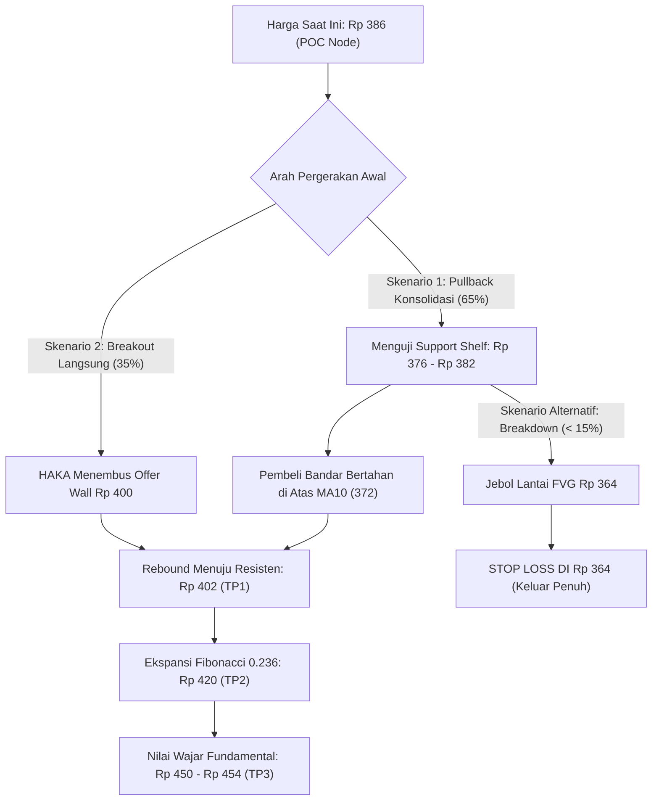

# DESK SNAPSHOT — SMDR

**Samudera Indonesia Tbk. · Transportasi & Logistik / Logistik & Pengantaran · Syariah: Ya (ISSI)**

**Horizon:** Short Swing 2–14 hari · **Grafik Utama:** 4-Jam (4H) · **Multi-Timeframe:** 1H (Edge) · 4H (Struktur) · Daily (Makro)  
**Harga Saat Ini:** **Rp 386** (live quote sesi I) · **Penutupan Sebelumnya:** Rp 384 · **Perubahan:** +0,52%  
**Waktu Analisis:** Kamis, 10 September 2026 10:42 WIB · Pasar Buka (Sesi I)  
**Eksekusi:** Manual · Riset & Rencana Perdagangan Institusional (Bukan Perdagangan Otomatis / Non-OMS)

---

## 1. Keputusan Desk (30 Detik)

| Parameter | Pembacaan / Sikap Desk |
| :--- | :--- |
| **Sikap (Stance)** | **ACCUMULATE ON PULLBACK / CAUTIOUS GO** (Momentum bullish sangat kuat, harga saat ini berada di bawah rata-rata akumulasi bandar kemarin di Rp 390,4; manfaatkan pullback terukur) |
| **Alokasi Posisi** | **Half Size** (Maksimal 50% dari alokasi portofolio short swing untuk mengantisipasi volatilitas overbought RSI) |
| **Skor Kuantitatif** | **57.4 / 100** — **HOLD** — Ditopang valuasi murah (*deep value*, kas bersih melimpah Rp 1,2 T) dan akumulasi bandar konsisten, namun dibatasi oleh fase konsolidasi teknikal paska lonjakan tajam |
| **Teknikal & Tren** | **Strong Bullish Run** — ADX 14 menguat ke level 55,57 (+DI 60,9), harga bertahan di atas MA10 (372) dan MA20 (354), Volume Profile POC bergeser naik kokoh ke Rp 386 |
| **Smart Money / Bandar**| **Accumulating** — Broker asing (**AK**) memborong agresif kemarin sebanyak 172.221 lot @ rata-rata Rp 391,88; akumulasi 1 bulan dipimpin AK (277k lot) dan AG (133k lot) |
| **Pita Transaksi & Antrean** | **Offer Wall Absorbed / Liquidity Improving** — Dinding offer raksasa 220k lot kemarin telah menyusut ke 137k lot, rasio Bid/Offer membaik tajam dari 0,31x menjadi 0,60x |
| **Valuasi Intrinsik** | **Deep Value Undervalued** — P/E TTM 6,79x, PBV 0,63x, Kas per saham (Rp 404,5) melampaui harga pasar (Rp 386). Nilai wajar model campuran di **Rp 453,6** (Margin of Safety +14,9%) |
| **Katalis & Berita** | **Constructive Growth** — Pelayaran perdana di Pelabuhan Patimban, investasi tanker Rp 460M, dan dividen interim Rp 2,5/saham mempertegas fundamental prima |

> **Ringkasan Eksekutif:**  
> SMDR mengonfirmasi penyerapan likuiditas yang sangat sehat paska rally. Fakta krusial hari ini: harga saham di pasar (**Rp 386**) saat ini diperdagangkan **di bawah rata-rata akumulasi broker bandar utama kemarin (AK memborong 172k lot di harga Rp 391,88)**. Ditambah dinding jual (*offer wall*) yang telah berkurang signifikan, area Rp 376–384 merupakan zona akumulasi terukur (*buy on weakness*) dengan target ekspansi bertahap menuju Rp 420–450.

---

## 2. Panduan Tindakan (What to Do)

- **Lakukan (Do):** Lakukan akumulasi bertahap (*scale-in*) di area penyangga volume POC dan batas atas FVG 4H di rentang **Rp 376 – Rp 384**.
- **Hindari (Don't):** Jangan melakukan pembelian agresif (*full chase*) saat harga mendekati resisten psikologis Rp 398–400 karena osilator RSI (79,87) masih berada di zona jenuh beli (*overbought*).
- **Pantau (Watch):** Perhatikan apakah harga mampu bertahan di atas level POC Rp 386 saat penutupan Sesi I, serta aksi lanjutan dari broker **AK** dan **SQ**.
- **Titik Batas Risiko (Invalidation):** Penutupan harian (*daily close*) di bawah **Rp 364** (menembus batas bawah Fair Value Gap 4H dan area Fibonacci 0.500).
- **Ketentuan Fraksi Harga:** Fraksi harga IDX adalah **Kelompok 2 (Rp 200–500)** dengan nilai **Rp 2 per tick**.

---

## 3. Rencana Perdagangan (Tingkat Harga Riil / Orderable Levels)

Semua tingkat harga disesuaikan secara ketat dengan fraksi resmi IDX (kelipatan genap Rp 2).

### Rencana A — Akumulasi Penyangga Volume & Pullback FVG (Prioritas Utama)

Skenario optimal dengan memanfaatkan jeda konsolidasi di atas rak likuiditas POC 386 dan bantalan FVG 4H.

| Parameter Level | Harga Riil (IDX) | Rasionale & Keterangan Struktur |
| :--- | :---: | :--- |
| **Zona Masuk (Entry Area)** | **Rp 376 – Rp 382** | Retest area penyangga penawaran-berbalik-permintaan (*flipped S/R*) & batas atas FVG 4H |
| **Harga Acuan Masuk (Avg Entry)**| **Rp 380** | Titik tengah akumulasi defensif di atas MA10 (Rp 372) |
| **Batas Rugi (Stop Loss)** | **Rp 364** | 1 tick di bawah lantai Bullish FVG 4H (364–370) & Fibo 0.500 (362) · **Risiko: 16 poin (-4,21%)** |
| **Target Profit 1 (TP1)** | **Rp 402** | Pengujian kembali level tertinggi Donchian 408 & penembusan resisten psikologis 400 · **Potensi: +22 poin (+5,79%)** |
| **Target Profit 2 (TP2)** | **Rp 420** | Resisten Fibonacci Retracement 0.236 di Rp 421 · **Potensi: +40 poin (+10,53%)** |
| **Target Profit 3 (TP3 / Fair Value)**| **Rp 450** | Mendekati estimasi Nilai Wajar Campuran Fundamental (Rp 453,6) · **Potensi: +70 poin (+18,42%)** |
| **Rasio Risk/Reward ke TP1** | **1,38 : 1** | Target realistis untuk pengamanan modal awal |
| **Rasio Risk/Reward ke TP2** | **2,50 : 1** | Target ekspansi momentum swing jangka 2–14 hari |
| **Rasio Risk/Reward ke TP3** | **4,38 : 1** | Target penguncian keuntungan penuh berbasis fundamental |

### Rencana B — Penembusan Momentum Resisten (Breakout Aggressive)

Skenario eksekusi jika harga langsung ditembuskan ke atas dinding penawaran Rp 400 dengan volume ledakan.

| Parameter Level | Harga Riil (IDX) | Rasionale & Keterangan Struktur |
| :--- | :---: | :--- |
| **Harga Masuk (Breakout Entry)**| **Rp 402** | Beli instan saat terkonfirmasi tembus di atas Upper Bollinger Band (398) & resisten 400 |
| **Batas Rugi (Stop Loss)** | **Rp 388** | Di bawah resisten lama yang berubah menjadi batas support baru · **Risiko: 14 poin (-3,48%)** |
| **Target Profit 1 (TP1)** | **Rp 426** | Area pengujian resisten ekspansi swing lanjutan · **Potensi: +24 poin (+5,97%)** |
| **Target Profit 2 (TP2)** | **Rp 454** | Target pencapaian Nilai Wajar Fundamental Blended · **Potensi: +52 poin (+12,94%)** |
| **Rasio Risk/Reward ke TP1** | **1,71 : 1** | Rasio terukur untuk strategi penembusan momentum cepat |
| **Rasio Risk/Reward ke TP2** | **3,71 : 1** | Potensi reli penuh menuju nilai intrinsik |

### Pembelian Langsung di Harga Pasar (Chase at Spot Rp 386)?
- **Panduan:** Spot Rp 386 berada tepat di titik sentral likuiditas (*Volume Profile POC*). Trader agresif dapat melakukan *partial entry* (seperempat ukuran posisi) di Rp 384–386, namun alokasi penuh sebaiknya menunggu penyelesaian antrean beli di Rp 376–382 untuk menjaga rasio risiko tetap optimal.

---

## 4. Landasan Analisis & Struktur Pasar

```
Grafik 4H / D1 SMC:
Resisten Ekspansi / Nilai Wajar : Rp 450 - Rp 454  (Target Ekstrem & Fair Value)
Resisten Fibo 0.236             : Rp 420 - Rp 422  (Target Swing Lanjutan)
Resisten Donchian & Upper BB    : Rp 398 - Rp 408  (Area Penjualan / Supply Zone)
Harga Pasar Saat Ini            : Rp 386           (Titik Sentral POC Volume 386)
--------------------------------- ZONA AKUMULASI PULLBACK ---------------------------------
Penyangga Permintaan Flipped    : Rp 380 - Rp 384  (Support Shelf & Titik Masuk Ideal)
Unfilled Bullish FVG 4H         : Rp 364 - Rp 370  (Area Rebound Utama & Garis MA10 di 372)
Batas Bawah Struktur / Stop Loss: Rp 364           (Invalidasi Tren Jangka Pendek)
-------------------------------------------------------------------------------------------
Support Dinamis MA20 & Mid BB   : Rp 354           (Lantai Tren Bullish Harian)
```

### Struktur Grafik & Smart Money Concept (SMC)
- **Fase Wyckoff & Pergeseran Struktur:** SMDR berada dalam fase **Markup (Tahap D/E)** yang sangat matang. Setelah menembus fase akumulasi panjang di Rp 300–320, struktur pada kerangka D1, 4H, dan 1H mengonfirmasi *Bullish Continuation / Break of Structure* (BoS).
- **Kekuatan Tren (ADX):** Indikator ADX 14 melonjak ke angka **55,57** dengan +DI berada di **60,90** dan -DI hanya **6,37**. Ini mengindikasikan bahwa dominasi pembeli berada pada level ekstrem institusional.
- **Dinamika Osilator (RSI & MACD):** RSI 14 berada di level **79,87** (mulai mendingin dari posisi kemarin di 84,37). MACD berada di atas garis nol (MACD 16,80 vs Signal 14,14) dengan histogram positif (+2,66), mengonfirmasi momentum ekspansif belum berakhir meski mulai mengalami perlambatan wajar (*consolidation pause*).
- **Pergeseran Volume Profile POC:** Terjadi lompatan struktural yang sangat signifikan pada node likuiditas utama: POC yang sebelumnya berada di level Rp 299 kini **bergeser naik ke Rp 386** dengan total transaksi terkonsentrasi di rentang Rp 383–389 (134,5 juta lembar saham). Level Rp 386 kini berfungsi sebagai lantai tumpuan harga baru (*new institutional floor*).

### Arus Dana Cerdas (Bandarmologi Flow)
- **Akumulasi Masif Sesi Kemarin (9 September 2026):**  
  Pada perdagangan kemarin, terjadi akumulasi bersih skala besar (*Big Accumulation*) dengan nilai transaksi bandar mencapai **Rp 14,03 Miliar**. Broker asing **AK** melakukan aksi borong masif sebesar **172.221 lot** pada harga rata-rata **Rp 391,88**, didukung oleh broker lokal **SQ** yang menyerap **111.589 lot** di harga **Rp 388,11**. Rata-rata modal bandar pada sesi tersebut berada di **Rp 390,44**.  
  *Fakta bahwa harga saat ini berada di Rp 386 memberikan keunggulan taktis bagi investor ritel karena harga beli berada di bawah modal bandar besar.*
- **Konsistensi Akumulasi 1 Bulan:**  
  Dalam rentang 1 bulan terakhir, bandar mengakumulasi saham SMDR sebesar **Rp 25,41 Miliar** (status: *Big Acc*). Tiga pembeli terbesar didominasi broker institusi asing dan lokal: **AK** (277.409 lot @ 369,12), **AG** (133.631 lot @ 339,88), dan **SQ** (114.813 lot @ 365,23).
- **Penjualan Pihak Lawan Terdistribusi:**  
  Pihak penjual relatif tersebar merata antara broker asing dan ritel seperti ZP (94k lot), YP (69k lot), DX (58k lot), dan CP (30k lot).

### Evaluasi Nilai Fundamental (Deep Value)
- **Metrik Valuasi Sangat Murah:** P/E TTM tercatat **6,79x** dan P/E Annualised **5,65x** (jauh di bawah median industri dan IHSG di 7,98x). Rasio PBV hanya **0,63x** dengan Nilai Buku per Saham (BVPS) mencapai **Rp 610,70**.
- **Benteng Kas Bersih (*Net Cash Fort*):** Posisi kas per saham tercatat **Rp 404,53**—lebih tinggi dibandingkan seluruh harga sahamnya di pasar saat ini (Rp 386). SMDR memiliki utang bersih negatif (*Net Debt*) sebesar **-Rp 1,20 Triliun**, mengeliminasi risiko kebangkrutan (Altman Z-Score 4,19 di zona aman prima).
- **Nilai Wajar & Margin Keamanan:** Model valuasi campuran (*Blended Fair Value*) menetapkan target nilai wajar di **Rp 453,6**, menghasilkan *Margin of Safety* positif sebesar **+14,9%**, sementara formula konservatif *Graham Number* berada di level **Rp 883,8**.

---

## 5. Ringkasan Aliran Broker (Top 5 Pembeli & Penjual)

### Akumulasi 1 Bulan Terakhir (09 Agustus – 09 September 2026)
*Status Bandar: **Big Accumulation** · Nilai Total: Rp 25,41 Miliar · Rata-rata Harga Bandar: Rp 362,81*

```
TOP 5 NET BUYERS (1 Bulan):
1. AK (Asing)      : 277.409 lot  |  Nilai: Rp 10,61 Miliar  |  Harga Rata-rata: Rp 369,12
2. AG (Asing)      : 133.631 lot  |  Nilai: Rp 4,54 Miliar   |  Harga Rata-rata: Rp 339,88
3. SQ (Lokal)      : 114.813 lot  |  Nilai: Rp 4,37 Miliar   |  Harga Rata-rata: Rp 365,23
4. LG (Lokal)      :  56.433 lot  |  Nilai: Rp 2,04 Miliar   |  Harga Rata-rata: Rp 355,98
5. DR (Asing)      :  41.615 lot  |  Nilai: Rp 1,36 Miliar   |  Harga Rata-rata: Rp 331,04

TOP 5 NET SELLERS (1 Bulan):
1. ZP (Asing)      :  94.514 lot  |  Nilai: Rp 3,35 Miliar   |  Harga Rata-rata: Rp 349,74
2. YP (Asing)      :  69.929 lot  |  Nilai: Rp 2,96 Miliar   |  Harga Rata-rata: Rp 354,30
3. DX (Pemerintah) :  58.606 lot  |  Nilai: Rp 1,81 Miliar   |  Harga Rata-rata: Rp 309,77
4. YU (Asing)      :  51.547 lot  |  Nilai: Rp 1,68 Miliar   |  Harga Rata-rata: Rp 327,92
5. CP (Asing)      :  30.092 lot  |  Nilai: Rp 1,57 Miliar   |  Harga Rata-rata: Rp 373,93
```

### Akumulasi Sesi Terakhir (Perdagangan Kemarin, 09 September 2026)
*Status Bandar: **Big Accumulation** · Nilai Total: Rp 14,03 Miliar · Rata-rata Harga Bandar: Rp 390,44*

```
TOP BUYERS (Sesi Terakhir):
1. AK (Asing)      : 172.221 lot  |  Nilai: Rp 6,74 Miliar   |  Harga Rata-rata: Rp 391,88
2. SQ (Lokal)      : 111.589 lot  |  Nilai: Rp 4,33 Miliar   |  Harga Rata-rata: Rp 388,11
3. XL (Lokal)      :  32.548 lot  |  Nilai: Rp 1,29 Miliar   |  Harga Rata-rata: Rp 393,17

TOP SELLERS (Sesi Terakhir):
1. CP (Asing)      :  81.750 lot  |  Nilai: Rp 3,18 Miliar   |  Harga Rata-rata: Rp 389,16
2. YP (Asing)      :  57.460 lot  |  Nilai: Rp 2,25 Miliar   |  Harga Rata-rata: Rp 391,98
3. ZP (Asing)      :  49.302 lot  |  Nilai: Rp 1,91 Miliar   |  Harga Rata-rata: Rp 387,47
```

---

## 6. Buku Pesanan & Dinamika Likuiditas (Order Book)

Kedalaman antrean 10 level pada Sesi I (10 September 2026):

```
+-----------------------------------------------------------------------------+
|                          ORDER BOOK SMDR (10 LEVEL)                         |
+------------------------------------+----------------------------------------+
|      BID (Permintaan Beli)         |         OFFER (Penawaran Jual)         |
|  Antrean   Volume (Lot)    Harga   |   Harga    Volume (Lot)   Antrean      |
+------------------------------------+----------------------------------------+
|     28          1.842       386    |    388         4.718        36         |
|     34          9.191       384    |    390        12.499        99         |
|     69         15.051       382    |    392         9.952        53         |
|    139         16.614       380    |    394         7.972        63         |
|     60         15.511       378    |    396        12.443       113         |
|     38          4.227       376    |    398         6.541        54         |
|     34          8.358       374    |    400        27.067       206  <-- Wall|
|     47          5.097       372    |    402         4.811        35         |
|     31          4.777       370    |    404         4.970        31         |
|     19          2.702       368    |    406         3.280        28         |
+------------------------------------+----------------------------------------+
| Total Bid:     83.370 Lot          | Total Offer:  137.821 Lot              |
| Rasio Bid / Offer: 0,60x (Membaik signifikan dari 0,31x kemarin)             |
+-----------------------------------------------------------------------------+
```

- **Peredaman Dinding Jual (*Offer Wall Dissolution*):** Total penawaran jual mengalami penurunan tajam dari **220.748 lot** kemarin menjadi **137.821 lot** hari ini. Level Rp 394 dan Rp 396 yang kemarin dipagari lebih dari 91.000 lot kini telah terserap menjadi masing-masing hanya ~7.900 dan ~12.400 lot. Dinding resisten psikologis kini bergeser ke **Rp 400 (27.067 lot)**.
- **Penguatan Bantalan Beli (*Bid Cushion*):** Antrean beli tebal tersusun rapi di area **Rp 378 – Rp 382** dengan akumulasi lebih dari 47.000 lot, mengonfirmasi minat beli institusi yang siap menampung koreksi minor.

---

## 7. Keselarasan Multi-Timeframe (MTF Alignment)

| Kerangka Waktu | Peran Analisis | Status Tren | Indikator Kunci | Struktur SMC / Price Action |
| :--- | :--- | :--- | :--- | :--- |
| **1-Jam (1H)** | *Edge / Entry Trigger* | Konsolidasi Sehat | RSI 71,2 · MACD Rata | Menahan rak likuiditas POC 386, bersiap membentuk *Higher Low* |
| **4-Jam (4H)** | *Struktur Utama Swing* | Strong Bullish | ADX 55,57 · CMF +0,23 | Di atas MA10 (372); terdapat Unfilled Bullish FVG di 364–370 |
| **Daily (D1)** | *Konteks Makro / Trend*| Breakout Ekspansif | MA20 (354) · MA50 (329)| Konfirmasi *Bullish BoS/CHoCH*, menembus garis resisten multi-bulan |

---

## 8. Katalis Pendorong & Faktor Risiko

### Katalis Penggerak (Tailwinds)
1. **Ekspansi Rute Patimban:** Pengoperasian rute perdana MV Samudera di Pelabuhan Patimban memperkuat jaringan rantai pasok otomotif dan industri nasional.
2. **Investasi Armada Tanker:** Penyaluran modal Rp 460 Miliar untuk kapal *chemical tanker* baru mengamankan diversifikasi margin tinggi di luar pengangkutan kontainer umum.
3. **Imbal Hasil Dividen & Wacana Buyback:** Dividen interim yang rutin dibagikan serta wacana aksi korporasi pembelian kembali (*buyback*) saham bertindak sebagai katalis *re-rating* PBV menuju nilai bukunya.

### Faktor Risiko (Headwinds & Invalidation)
1. **Normalisasi Freight Rate Global:** Potensi normalisasi tarif kontainer rute internasional yang dapat menekan margin jangka panjang.
2. **Koreksi Jenuh Beli Ekstrem:** RSI yang berada di sekitar area 80 berpotensi memicu aksi ambil untung cepat (*flash pullback*) sebelum melanjutkan reli.
3. **Level Pembatalan:** Penutupan D1 di bawah **Rp 364** membatalkan momentum swing jangka pendek dan mengharuskan posisi di-cut loss.

---

## 9. Kartu Skor Kuantitatif (Master Quant Score 360°)

Perhitungan deterministik berbasis spesifikasi resmi (`core/specs/quant-score-spec.json`) untuk mode **Short Swing**:

```
+------------------------------------------------------------------------------------+
|                       MASTER QUANT SCORE 360° — SMDR                               |
|                         HORIZON: SHORT SWING (2-14 HARI)                           |
+----------------------+---------+------------+-----------+--------------+-----------+
| Domain Intelijen     |  Bobot  | Skor Asli  | Skor Maks | Kontribusi   | Status    |
+----------------------+---------+------------+-----------+--------------+-----------+
| Technical Momentum   |   25%   |    14.5    |    20     |  18.1 / 25   | BULLISH   |
| Fundamental & Value  |   15%   |     9.0    |    20     |   6.8 / 15   | DEEP VALUE|
| Catalyst & Sentiment |   20%   |     7.0    |    20     |   7.0 / 20   | MODERATE  |
| Bandarmologi Flow    |   40%   |    25.5    |    40     |  25.5 / 40   | BIG ACC   |
+----------------------+---------+------------+-----------+--------------+-----------+
| TOTAL SKOR KUANTITATIF         |            |           |  57.4 / 100  | HOLD band |
+--------------------------------+------------+-----------+--------------+-----------+
```

*Klasifikasi Rating: STRONG BUY (≥80) · BUY (≥65) · **HOLD (≥45)** · SELL (≥30) · STRONG SELL (<30)*  
*Catatan Desk: Meskipun skor berada di pita HOLD (57.4) akibat pengetatan osilator teknikal dan moderasi berita makro, profil risk/reward untuk akumulasi pullback sangat menarik karena didukung harga pasar yang berada di bawah biaya bandar utama (AK).*

---

## 10. Skenario Perjalanan Harga & Titik Kritis



---

*Pernyataan Penafian (Disclaimer):*  
*Analisis ini bersifat probabilistik dan edukasional berbasis data pasar real-time serta metodologi kuantitatif deterministik. Laporan ini bukan merupakan rekomendasi mutlak jual/beli instrumen keuangan tertentu. Tingkat harga yang disajikan bersifat saran konsultatif untuk eksekusi manual mandiri. Selalu terapkan manajemen risiko dan ukuran posisi yang disiplin.*
